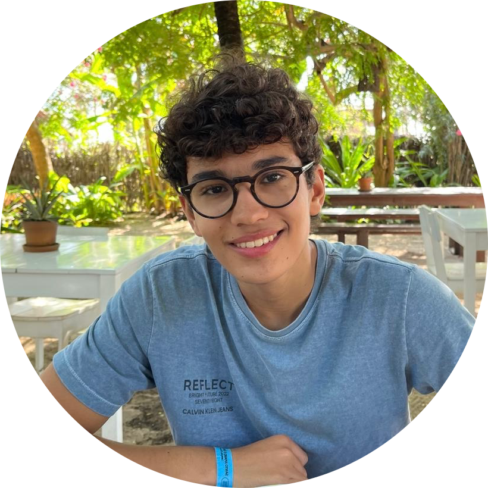

<!-- # Paulo Fonseca

 -->

# Quem sou eu?

Meu nome é __Paulo Fonseca__, sou nascido em Recife, Brasil e atualmente estou cursando __Ciência da Computação na CESAR School__. Tenho forte motivação pelo estudo da Computação, em especial, no momento, na área de Back-End. Apesar disso, já atuei como designer freelancer, o que me motiva por em breve aprimorar minhas habilidades na área de Front-End para buscar uma ocupação como __Full-Stack__.

## Meus interesses

* Python, __Java__
* __HTML, CSS, JS__
* Cybersegurança

## Melhores habilidades (até o momento)

* Python
* Programação de Arduino em C++

## Contato

* Email: [paulinhoff2007@gmail.com](mailto:paulinhoff2007@gmail.com)
* GitHub: [github.com/paulofonsecacsr](https://github.com/paulofonsecacsr)
* Behance: [be.net/pfpxm](https://be.net/pfpxm)
